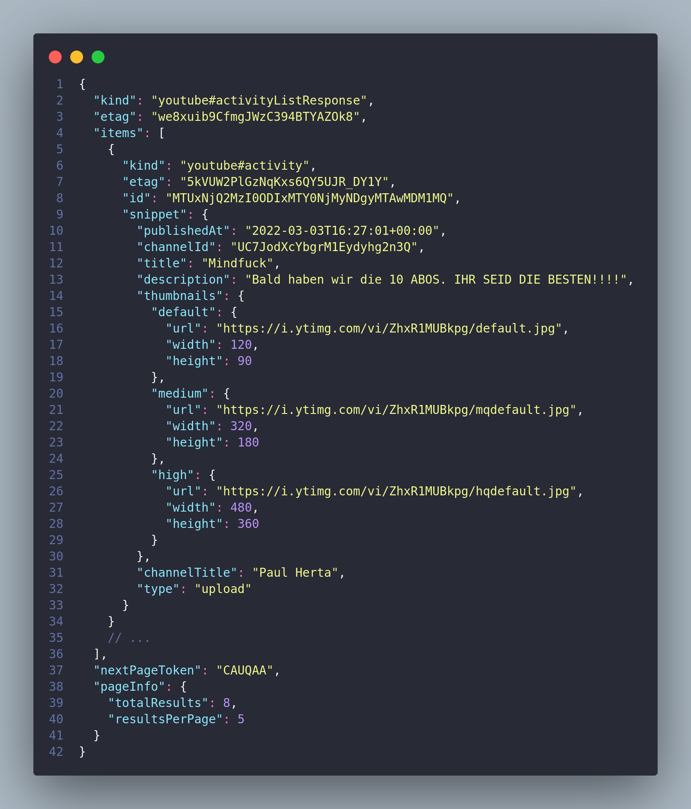

# Backend

## Set-up

Eine .env erstellen mit folgendem Inhalt:

- PORT=[your Port]
- INSTAGRAM_CLIENT_ID=[instagram-client-id aus Instagram-dev]
- INSTAGRAM_CLIENT_SECRET=[instagram-client-secret aus Instagram-dev]
- YOUTUBE_CLIENT_ID=[google-app id]
- YOUTUBE_PROJECT_ID=[google-project id]
- YOUTUBE_CLIENT_SECRET=[google-app secret]

weitere Properties könnten folgen.

## Instagram Basic API

`https://graph.instagram.com/{user_id}?fields=[id,username,media]`

Rückgabe:

- id: user_id
- username: username
- media: ein data Array mit den Ids zu den Medien

`https://graph.instagram.com/{media_id}?fields=[id,caption,media_type,media_url,permalink,timestamp,username,children]`

Rückgabe:

- caption: caption
- media_type: media_type in Uppercase => IMAGE,VIDEO,CAROUSEL_ALBUM
- media_url: Link zum Datenbankeintrag
- media_count: Anzahl an Medien
- permalink: Link zum content
- timestamp: timestamp zum Upload
- username: username
- children: NUR BEI CAROUSEL_ALBUM => ids der einzelnen Medien im Album

## Youtube  

[Vollständige API Reference](https://developers.google.com/youtube/v3/docs)

`https://www.googleapis.com/youtube/v3/channels?access_token={access_token}&part=snippet&mine=true`

Rückgabe: Channel Informationen

`https://www.googleapis.com/youtube/v3/channels?contentdDetails&access_token={access_token}part=brandingSettings&mine=true`

Rückgabe: Channel Branding Settings

`https://www.googleapis.com/youtube/v3/activities?[mine=true or channelId={channelId} or home=true]&access_token={access_token}&part=snippet`

Rückgabe: Activity Liste

- mine=true => authenticated users activities
- channelId => activities des Channels mit der ID channelId
- home=true => activities of subscribed channels

## Scripts

Alle Scripts aus /backend starten!

### ./bin/start

- Startet den server lokal ohne imports neu zu cachen
- funktioniert mit alten Versionen
- statisch

### ./bin/devstart

- überprüft imports mit quelle
- holt neue imports hinzu
- startet in watchmode --> Hot Reload

### ./bin/reload

- holt neueste Updates für imports

### Services
General.ts:

- getChannelInformations(token) holt sich die alle Channel Informationen des eigenen Channels. Alle weiteren Methoden rufen diese auf und filtern einzelne Daten aus der JSON raus und geben diese zurück
- getChannelName(token) gibt den Namen des Channels zurück
- getChannelDescription(token) gibt die Beschreibung des Channels zurück
- getChannelPublishedAt(token) gibt das Datum zurück, an dem der Cahnnel ertellt wurde

myStats.ts:

- getVideoQuantity(token) -> Gesamtanzahl an Videos auf eigenem Channel 
- getSubscriberQuantity(token) -> Gesamtanzahl an Subscribern 
- getAllTimeViews(token) -> Gesamtanzahl an Views auf alle Videos

- getLatestVideo(token) -> Liefert die VideoId des neuesten (zuletzt hochgeladenen) Videos

- getVideoViewsQuantity(token, videoId) -> Anzahl an Views auf ausgewähles Video
- getVideoLikesQuantity(token, videoId) -> Anzahl an Likes auf ausgewähles Video
- getVideoDislikesQuantity(token, videoId) -> Anzahl an Dislikes auf ausgewähles Video
- getVideoCommentQuantity(token, videoId) -> Anzahl an Kommentaren auf ausgewähles Video